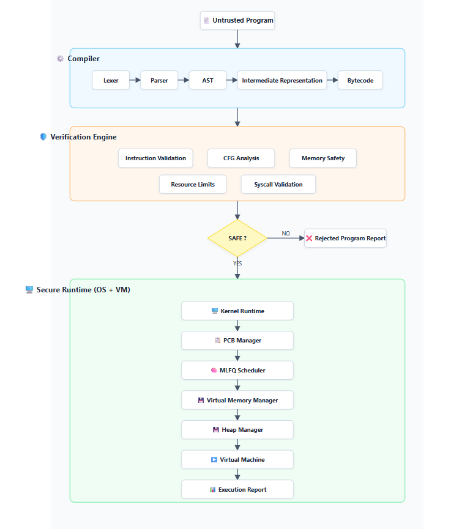
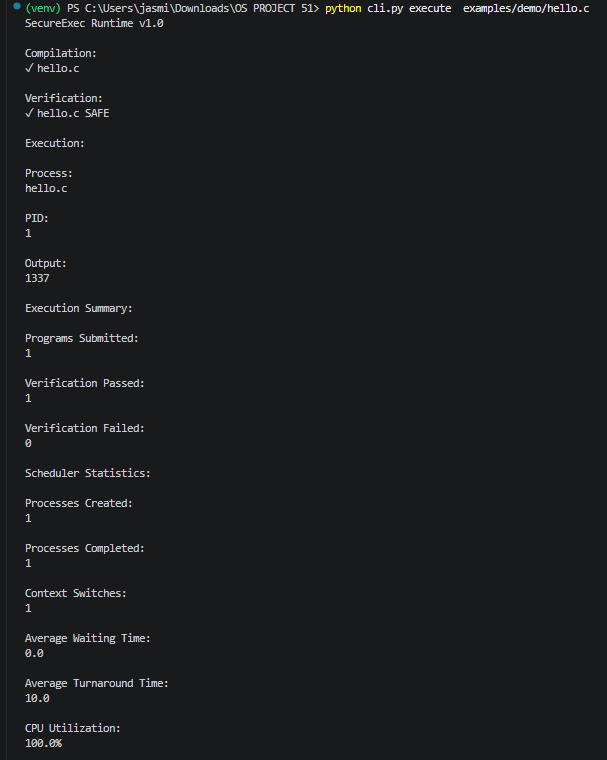
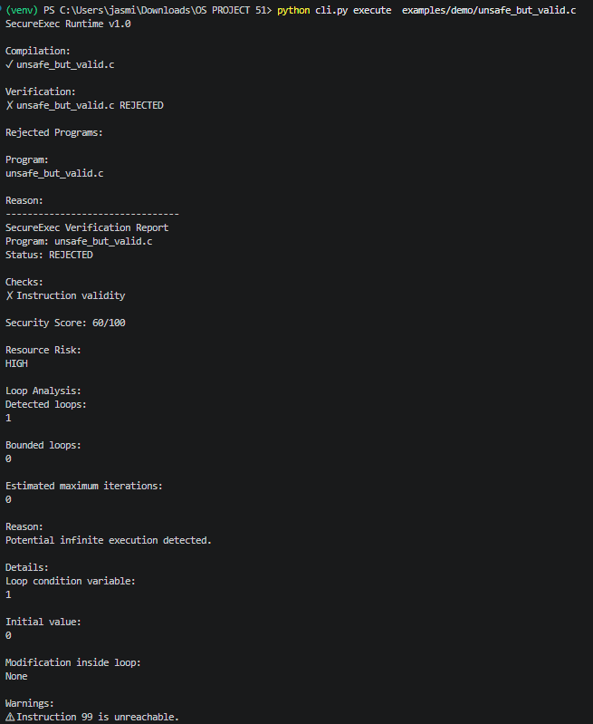
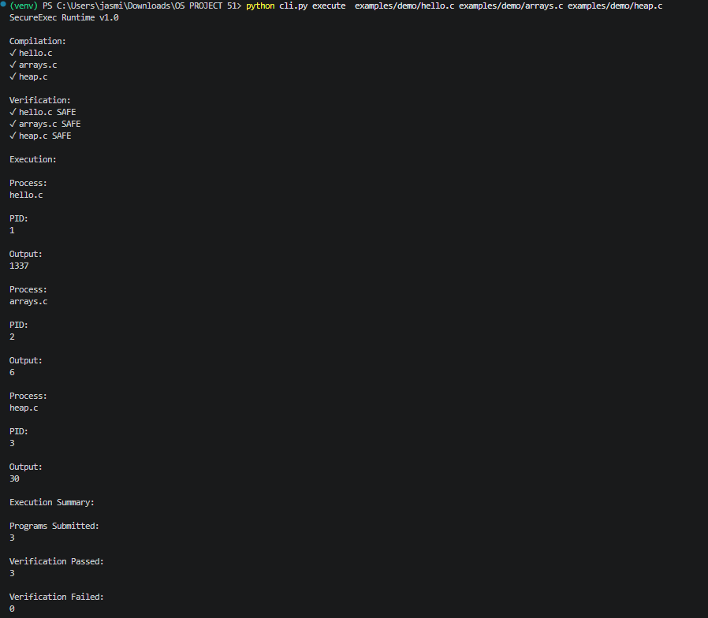

# SecureExec
## A Verification-Driven Secure Sandbox Runtime

SecureExec implements a verification-driven secure sandbox runtime. It demonstrates how untrusted programs can be compiled, verified, isolated, and executed safely inside a miniature operating-system runtime.

Modern systems constantly execute untrusted code:
- Online judges evaluating user submissions
- Plugin architectures extending application functionality
- Cloud and serverless function scaling
- Third-party webhook and API integrations
- AI-generated code execution

SecureExec addresses the inherent risks of external execution by analyzing programs *before* execution and running approved programs inside an isolated virtual environment, establishing strict static bounds on memory and execution.

## Why SecureExec?

SecureExec bridges the gap between language design and secure operating systems. In real-world scenarios—such as evaluating submissions on online judges, securely running plugin logic, or executing cloud workloads and AI-generated scripts—running untrusted code natively poses catastrophic security risks. 

This project demonstrates how compiler design, static verification, and operating system concepts can work seamlessly together to execute untrusted programs safely and reliably.

## Motivation

Modern systems increasingly execute externally generated code. Executing untrusted programs natively creates massive security risks, including:
- resource abuse and CPU hijacking
- invalid memory access
- unauthorized system interaction
- unstable execution states

SecureExec demonstrates a layered architectural approach to this problem:
**Program → Verification → Isolation → Controlled Execution**

## System Architecture

The core of SecureExec relies on a strict execution flow:

```text
Program
   ↓
Compiler
   ↓
Bytecode
   ↓
Verifier
   ↓
Kernel
   ↓
Scheduler
   ↓
Virtual Machine
   ↓
Execution Report
```

- **Compiler**: Converts supported source programs into custom bytecode.
- **Verifier**: Analyzes the generated bytecode statically before execution, outright rejecting programs that violate security rules.
- **Kernel**: Manages processes, MLFQ scheduling, virtual memory translation, and resource ownership.
- **Scheduler**: Orchestrates process states and context switches across simulated CPU quantums.
- **Virtual Machine**: Safely executes only verified instructions inside the sandbox boundaries.
- **Execution Report**: Outputs final telemetry detailing resource usage and exit status.



## Tech Stack

**Programming Language**
- Python 3.10+ (Runtime and Engine)
- C-Subset (Demonstration Frontend)

**Compiler**
- Lexer
- Parser
- AST
- Intermediate Representation
- Bytecode Generation

**Verification**
- Static Bytecode Analysis
- CFG Construction
- Memory Safety Verification

**Operating Systems**
- PCB
- MLFQ Scheduler
- Virtual Memory
- Heap Management

**Runtime**
- Custom Virtual Machine
- CLI

## Project Structure

```text
SecureExec/
├── benchmarks/          # Performance and isolation benchmarking scripts
├── compiler/            # C-subset lexer, parser, AST, and bytecode generation
├── core/                # Core execution logic
│   ├── memory/          # Virtual memory, heap tracking, page tables
│   ├── process/         # Process Control Block (PCB) definitions
│   ├── runtime/         # Orchestration pipeline and logging
│   └── vm/              # Virtual machine execution engine
├── docs/                # Architecture documentation and reports
├── examples/            # Example C programs and security attack payloads
├── os_layer/            # Kernel-level components
│   ├── scheduler/       # MLFQ process scheduler
│   └── syscalls/        # Safe system call handlers
├── tests/               # 89 automated unit and integration tests
├── verifier/            # Static security analyzer and CFG construction
└── cli.py               # PRIMARY ENTRY POINT: Main command-line interface
```

## Architecture Deep Dive

### Compiler Pipeline
Source Code → Lexer → Parser → AST → Intermediate Representation → Bytecode

### Verification Pipeline
Bytecode → Instruction Validation → CFG Analysis → Memory Analysis → Resource Analysis → SAFE / REJECTED

### Runtime Pipeline
Verified Program → PCB Creation → Scheduler → Virtual Memory → Virtual Machine → Runtime Report

## Verification Engine

Before execution, every program passes through the static verification engine. The verifier acts as an absolute gatekeeper, performing multiple independent analyses to detect and prevent unsafe execution patterns before the code ever touches memory.

**Bytecode Validation**
- opcode validation
- malformed bytecode detection
- invalid instruction rejection

**Control Flow**
- CFG construction
- invalid jumps detection
- unreachable instructions analysis
- loop analysis and execution bound analysis

**Memory and Resources**
- array bounds verification
- heap ownership tracking
- double free detection
- instruction limits
- syscall whitelist

## Runtime Architecture

Once static verification successfully proves a program is mathematically safe, the program enters the SecureExec runtime. Here, multiple operating-system components cooperate to execute it safely while maintaining strict environmental isolation.

- **Process Control Blocks (PCB)**: Each program runs isolated within a dedicated PCB, independently tracking PID, memory states, and execution metrics.
- **Virtual Memory**: Implements virtual address spaces mapped to physical frames, enforcing process separation.
- **Heap Manager**: Manages dynamic memory allocation (`malloc`/`free`) while enforcing bounds and ownership constraints.
- **MLFQ Scheduler**: A Multi-Level Feedback Queue handles CPU starvation, priority boosting, and context switching across multiple concurrent processes.

## Implementation Highlights

SecureExec implements:
- Compiler Pipeline
- AST Generation
- Intermediate Representation
- Bytecode Generation
- Static Verification Engine
- Virtual Machine
- Process Control Blocks
- MLFQ Scheduler
- Virtual Memory
- Heap Manager
- Runtime Reporting
- CLI

## Current Frontend Implementation

The SecureExec architecture is built around a bytecode verification interface. The current implementation demonstrates the complete pipeline using a C-subset frontend, making it easy to extend with future language frontends targeting the same verification backend.

Supported language features:
- integer variables
- arithmetic expressions
- if/else conditions
- while loops
- functions
- arrays
- malloc/free
- return statements
- print syscall

## Usage

SecureExec is executed directly via the Command Line Interface (`cli.py`). The CLI handles the entire pipeline seamlessly.

### Quick Start

**Clone repository**
```bash
git clone https://github.com/jasmineparvatham/SecureExec.git
cd SecureExec
```

**(Optional) Create virtual environment**
```bash
python -m venv venv
```

**Activate virtual environment**
```bash
# Windows
venv\Scripts\activate
# Linux/Mac
source venv/bin/activate
```

**Run CLI help**
```bash
python cli.py --help
```

**Compile example**
```bash
python cli.py compile examples/demo/hello.c
```

**Execute example**
```bash
python cli.py execute examples/demo/hello.c
```

**Run bytecode**
```bash
python cli.py run examples/demo/hello.bc
```

### Detailed Commands

**Show CLI help**
```bash
python cli.py --help
```

**Compile one program**
```bash
python cli.py compile examples/demo/hello.c
```

**Compile multiple programs**
```bash
python cli.py compile examples/demo/hello.c examples/demo/heap.c
```

**Verify bytecode statically**
```bash
python cli.py verify examples/demo/hello.bc
```

**Execute one program**
```bash
python cli.py execute examples/demo/hello.c
```

**Execute multiple programs (Concurrent scheduling)**
```bash
python cli.py execute examples/demo/hello.c examples/demo/heap.c
```

**Execute precompiled bytecode**
```bash
python cli.py run examples/demo/hello.bc
```

**Execute multiple bytecode programs**
```bash
python cli.py run examples/demo/hello.bc examples/demo/heap.bc
```

**Debug scheduler activity**
```bash
python cli.py execute examples/demo/hello.c --debug
```
*The `--debug` flag prints deep system insights including queue transitions, context switches, scheduler decisions, and process movement.*

## Demonstration

### Safe Execution

When passing safe code, SecureExec runs the full pipeline successfully.

```bash
python cli.py execute examples/demo/hello.c
```
**Compilation** ↓ **Verification Passed** ↓ **Execution** ↓ **Runtime Report**



### Unsafe Execution

When an attack vector or invalid code is submitted, SecureExec intercepts and blocks execution before memory allocation occurs.

```bash
python cli.py execute examples/demo/unsafe_but_valid.c
```
**Compilation** ↓ **Verification Failed** ↓ **Rejected Program Report**



### Multi-Process Execution

Executing multiple programs showcases the scheduler maintaining context-switching and concurrent execution bounds.

```bash
python cli.py execute examples/demo/hello.c examples/demo/arrays.c examples/demo/heap.c
```



## Evaluation

The project successfully demonstrates isolated process execution by validating both safe code and malicious payloads. The evaluation actively verified malformed bytecode rejection, CFG verification, and infinite-loop detection in the static phase. At runtime, the test suite confirmed heap ownership validation, double-free detection, scheduler fairness, and deep virtual memory isolation, terminating with consistent runtime reporting.

The project includes automated tests covering 89 passing integration and unit checks, alongside a robust internal benchmarking suite. The test suite explicitly validates:

| Component | Validation |
|-----------|------------|
| Compiler | Unit & Integration Tests |
| Verifier | Security Test Suite |
| Scheduler | Scheduling Benchmarks |
| Virtual Memory | Isolation Tests |
| Heap Manager | Ownership & Allocation Tests |
| Runtime | Execution Reporting Tests |

*Internal isolation benchmarks confirm 0 memory boundary violations across 100 concurrent processes executing over 13,500 memory operations and 27,000 page translations. The MLFQ scheduler successfully maintains CPU utilization in benchmark scenarios while using priority movement and starvation prevention mechanisms.*

For a detailed discussion of the architecture, implementation decisions, verification methodology, benchmarking, and evaluation, view [Final System Report](FINAL_SYSTEM_REPORT.md).

## Current Implementation

The current implementation includes:

✓ Compiler pipeline
✓ Static verification engine
✓ Virtual Machine
✓ Process Control Blocks
✓ Multi-Level Feedback Queue Scheduler
✓ Virtual Memory
✓ Heap Manager
✓ Command Line Interface
✓ Automated Test Suite

## Future Extensions

- additional language frontends
- richer program formats
- stronger symbolic verification techniques
- filesystem sandboxing capabilities
- optimized hardware JIT execution engines
