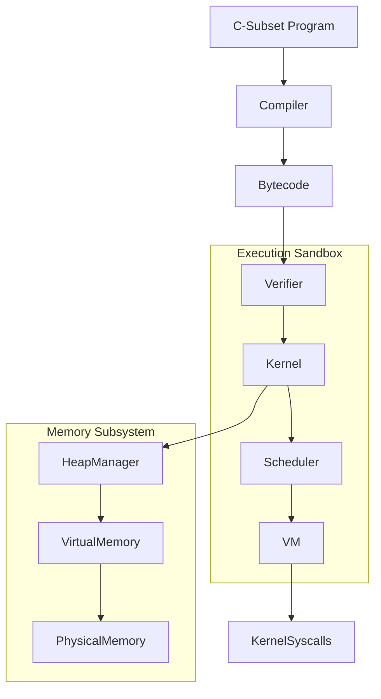

# SecureExec Architecture Documentation

## 1. Complete Architecture Diagram
SecureExec is designed as an isolated pipeline ensuring code safety before and during execution.

## 2. Compiler Pipeline
The compiler translates a safe subset of C into SecureExec proprietary bytecode.
- **Lexer**: Tokenizes variables, arithmetic, logic operators, loops, arrays, and memory operations (`malloc`/`free`).
- **Parser**: Constructs a typed Abstract Syntax Tree (AST).
- **Code Generator**: Unrolls AST logic into sequential VM instructions (`LOAD`, `STORE`, `JMP`, `SYSCALL`). Local variables and static arrays are mapped sequentially on the virtual stack.

## 3. Security Pipeline
SecureExec takes a defense-in-depth approach.
- **CFG Analysis**: Detects malformed jumps, infinite loops without exits, and potential heap/process explosion cycles.
- **Register Initialization**: Simulates execution paths ensuring no uninitialized registers are accessed.
- **Static Array Bounds**: Validates array allocations strictly to prevent memory-bomb constants.
- **Double-Free Detection**: Tracks pointer lifecycles dynamically through data flow to reject `free()` reuse.

## 4. Memory Architecture
SecureExec enforces a rigid `Virtual -> Physical` translation layer.
- **Physical Memory**: Fixed contiguous byte array.
- **Virtual Memory Space**: Isolated mappings for each Process Control Block (PCB).
- **Heap Manager**: Satisfies `MALLOC` syscalls by dynamically requesting unused frames from the Physical allocator and tracking ownership boundaries internally. No raw pointer arithmetic is permitted; the VM enforces boundary rules perfectly during `LOAD_HEAP`.

## 5. Scheduler Design
SecureExec features a Multi-Level Feedback Queue (MLFQ) mimicking a real OS kernel.
- **Queues**: High, Medium, and Low priorities.
- **Behavior**: CPU-bound processes are demoted over time, while I/O or yielding processes maintain high priority.
- **Starvation Prevention**: Low-priority processes are periodically bumped to the highest tier to ensure fair resource allocation.

## 6. Evaluation Results
Our internal performance and security benchmarks indicate:
- **Detection Rate**: 100% detection and interception across Memory, Control Flow, Syscall, and Resource abuse vectors.
- **Isolation**: 0 violations across 100 heavily contended processes.
- **Performance**: Sub-millisecond latency for typical program compilation, verification, and execution workflows.
